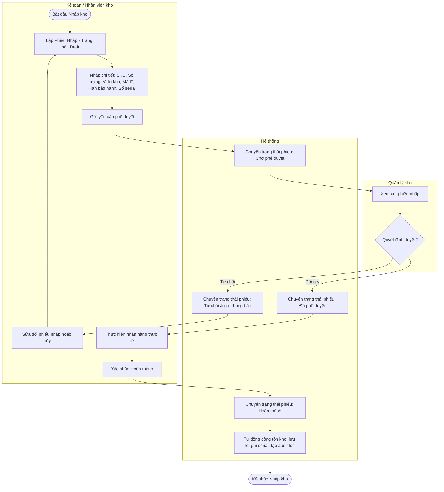
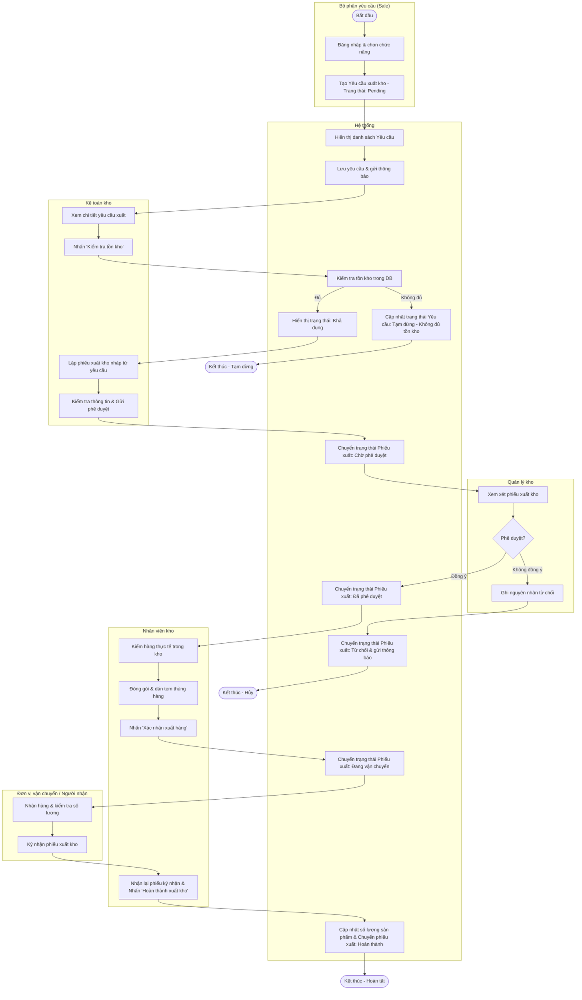
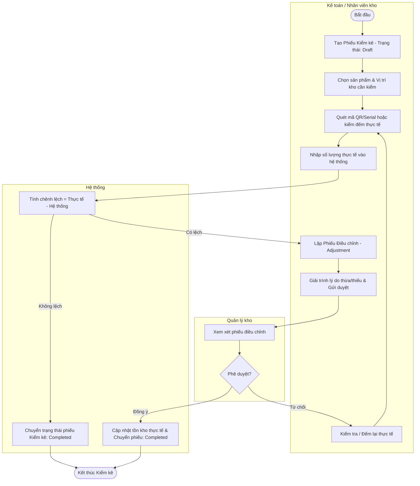

# Sơ đồ Quy trình Nghiệp vụ Kho (WMS) – FOSITEK (Bản cập nhật Swimlane)

Tài liệu này trình bày các quy trình nghiệp vụ Nhập kho, Xuất kho và Kiểm kê của Hệ thống Quản lý Kho (WMS) FOSITEK dưới dạng **sơ đồ làn phân vai (Swimlane)** thông qua cấu trúc `subgraph` của Mermaid.

---

## 1. Quy trình Nhập kho (Receipts Workflow)

Quy trình phối hợp giữa **Kế toán/Nhân viên lập phiếu**, **Quản lý phê duyệt** và **Hệ thống tự động** cập nhật cơ sở dữ liệu.

---

## 2. Quy trình Xuất kho (Deliveries Workflow)

Quy trình xuất kho phối hợp giữa 6 vai trò/bộ phận: **Bộ phận yêu cầu (Sale)**, **Hệ thống**, **Kế toán kho**, **Quản lý kho**, **Nhân viên kho** và **Đơn vị vận chuyển**.

---

## 3. Quy trình Kiểm kê & Điều chỉnh Tồn kho (Stocktake & Adjustment Workflow)

Quy trình phối hợp giữa **Kế toán/Nhân viên kiểm đếm**, **Quản lý phê duyệt** và **Hệ thống** cập nhật lại số lượng tồn kho.

